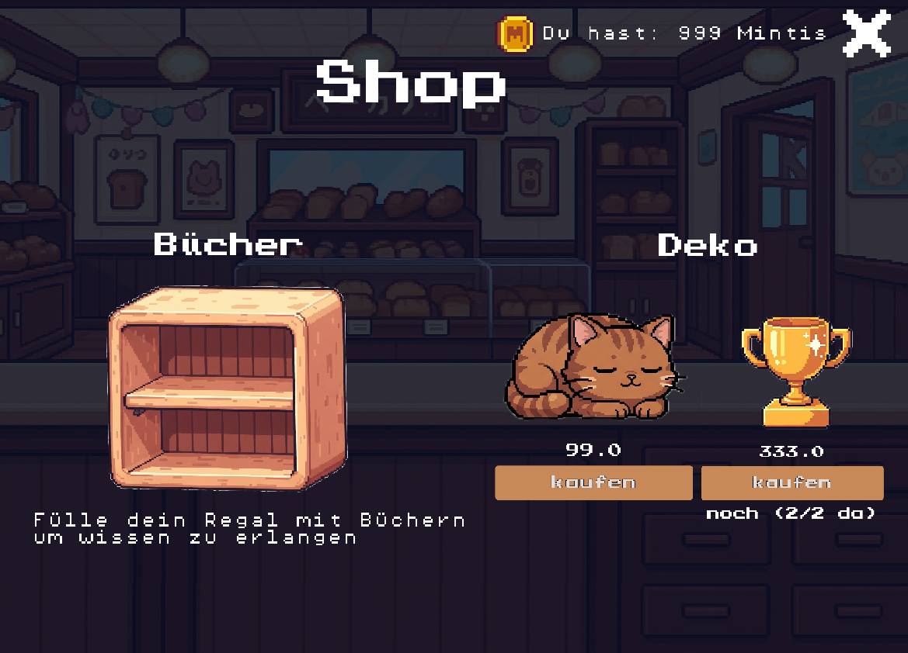
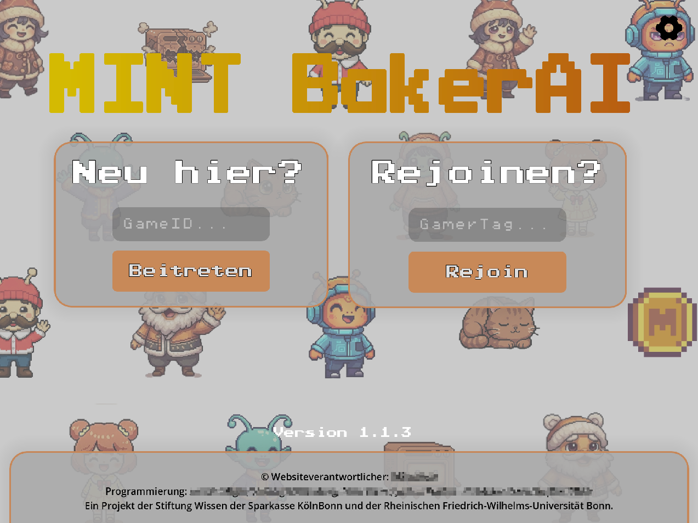

## From Idea to Product

Starting from the abstract goal of making the core principles of Large Language Models (LLMs) accessible to middle school students, our four-person team at university developed an educational web game.
While the project was constrained by the requirement that the game had to be integrated into an AI workshop organized by the [Stiftung Wissen der Sparkasse KölnBonn](https://www.stiftung-wissen-koelnbonn.de), we first had to develop the game’s conceptual structure ourselves through several exploratory design phases before any implementation could begin.
Essential for the success of the following implementation phase was the precise coordination between the frontend and backend team.

In the game ([mintki.de](https://mintki.de)) we demonstrate that LLMs can only provide reliable answers within the scope of their training data, while unfamiliar situations may lead to unexpected behavior such as hallucinations.
It also illustrates how biases in training data can propagate into real-world outcomes and affect decision-making processes.

## Feedback and Adaptions

Throughout development, the project was evaluated iteratively with multiple groups of students.
Feedback from these sessions was continuously incorporated to refine the gameplay experience.
Based on both user feedback and findings from current educational and gamification research, we introduced additional game mechanics (e.g. gamification elements) and adapted to the given environment (e.g. schools having old tablets only).

### Examples

The introduction of virtual coins and a shop visibly boosted the student's engagement in the levels:

Since many schools appear not to provide a stable internet connection, we had to store the users' progress in the backend and provide the option to rejoin:

